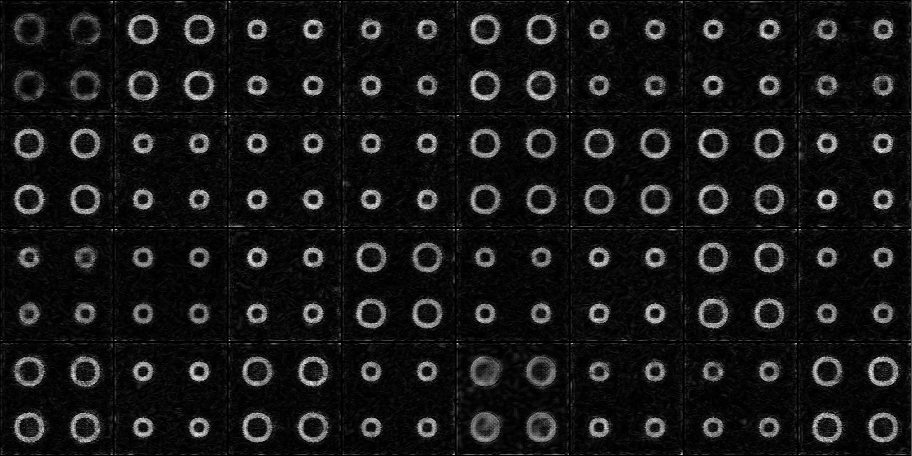

## Packages setup

1. A complete list of packages can be found in `env.yaml`. This python environment can be imported with `conda`. See [conda documentation](https://conda.io/docs/user-guide/tasks/manage-environments.html) for more information.

2. Refer to [link](https://pyradiomics.readthedocs.io/en/latest/) to install pyradiomcs if needed.
3. See below to install sumatra.
4. If the `conda` import is not working, try running the code until all import errors go away :)

## Contribute (Sumatra setup for experiment tracking)

```shell
  pip install --upgrade git+https://gitlab.vis.ethz.ch/vwegmayr/sumatra.git
  pip install gitpython
  smt init -d data -i data -e python -m run.py -c error -l cmdline feature-robustness
```

## Visual Feature Attribution using WGAN
A lot of code concerning the implementation of WGANs was taken over from [this repo](https://github.com/baumgach/vagan-code). As a general naming convention, the generator tries to transform images from the class `AD` to images of the class `CN`. The critic tries to differentiate between these fake generated `CN` images and real `CN` images.
### Synthetic Experiment
Here we briefly describe how to generate and train a model on synthetic data.
##### Data generation
```shell
python run.py --config toy_vagan/sample_syn_tzero_not_fixed.yaml -a transform -S data
```
or (with sumatra tracking)
```shell
smt run --config toy_vagan/sample_syn_tzero_not_fixed.yaml -a transform -S data
```
This will create a new folder in the sumatra `data` folder containing the generated synthetic data. The output folder can be configured by setting `params.outdir` in `toy_vagan/sample_syn_tzero_not_fixed.yaml`.

##### Model training
The model can be trained using
```shell
python run.py --config toy_vagan/disks_synthetic.yaml -a fit -S data
```
or (with sumatra tracking)
```shell
smt run --config toy_vagan/disks_synthetic.yaml -a fit -S data
```
The input folder has to be adapted by setting `params.stream_config.data_path` in `toy_vagan/disks_synthetic.yaml`, if it was changed in the previous step.
A new folder will be created in the `data` folder and the folder's name will contain the initial timestamp corresponding to the training starting point. This folder will contain tensorboard summaries and model checkpoints. The images summaries are named as follows. The `train_a_generated_CN` images correspond to the generated training images. The `train_b_difference_CN` correspond to the generated difference maps. The `train_example_AD_delta_img` images correspond to the ground-truth difference maps. The `train_example_AD` images correspond to the inputs fed to the generator.
Example images can be found in the `toy_vagan` folder. The model should be trained for at least 1500 steps, depending on the diversity of the input images.


